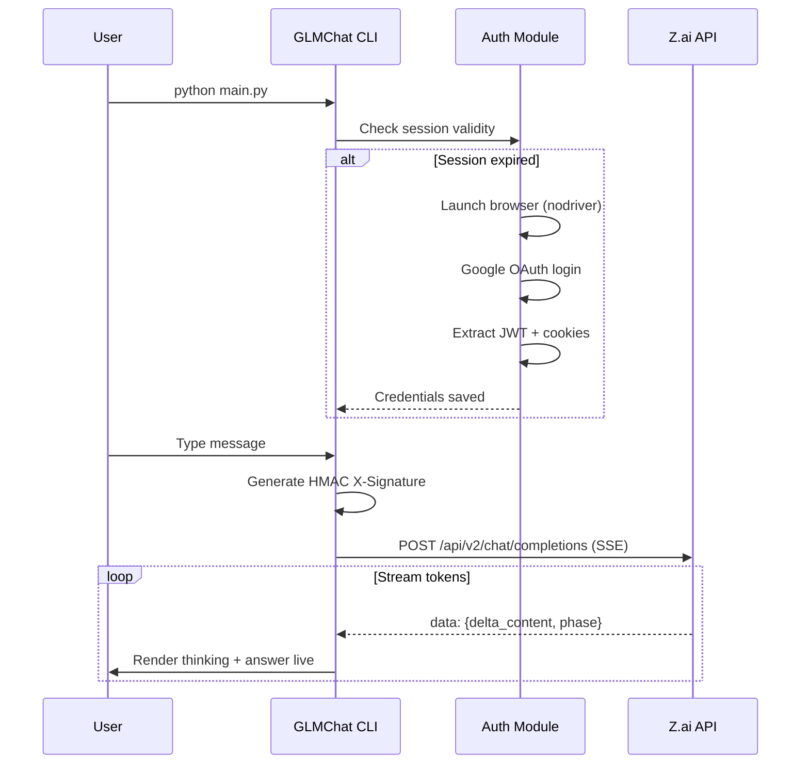

<p align="center">
  
</p>

<p align="center">
  <b>⚡ Lightning-fast CLI client for Z.ai powered by GLM-4.7</b>
</p>

<p align="center">
  <a href="#features"></a>
  <a href="#installation"></a>
  <a href="#usage"></a>
  <a href="https://github.com/TecTroncoso/GLMChat"></a>
</p>

---

## 🧠 What is GLMChat?

**GLMChat** is a high-performance command-line interface for [Z.ai](https://chat.z.ai) — the free AI chatbot platform powered by **GLM-4.7** (Zhipu AI). It brings the full power of GLM's reasoning capabilities directly into your terminal with real-time streaming, thinking visualization, and persistent conversation memory.

No API keys needed. No monthly fees. Just authenticate once and start chatting.

---

## ✨ Features

| Feature | Description |
|---------|-------------|
| 🔥 **Real-time Streaming** | Token-by-token response rendering with event-driven UI |
| 💭 **Thinking Visualization** | Watch the model reason step-by-step in a dedicated panel |
| 🧵 **Conversation Memory** | Multi-turn context tracking — the AI remembers your chat |
| 🔐 **Auto Authentication** | Automated Google OAuth login via headless browser |
| 🛡️ **X-Signature HMAC** | Fully reverse-engineered API signature generation |
| ⚡ **Optimized Performance** | Smart render throttling, cached headers, pre-encoded keys |
| 🎨 **Beautiful Terminal UI** | Rich-powered panels, markdown rendering & syntax highlighting |

---

## 📦 Installation

### Prerequisites

- **Python 3.9+**
- **Brave Browser** or **Google Chrome** (for initial authentication)

### Setup

```bash
# Clone the repository
git clone https://github.com/TecTroncoso/GLMChat.git
cd GLMChat

# Create virtual environment
python -m venv venv

# Activate (Windows)
venv\Scripts\activate

# Activate (Linux/macOS)
source venv/bin/activate

# Install dependencies
pip install -r requirements.txt
```

### Configuration

Create a `.env` file inside the `data/` directory:

```bash
mkdir data
```

```env
# data/.env
ZAI_EMAIL=your_google_email@gmail.com
ZAI_PASSWORD=your_password
```

> [!NOTE]
> Your credentials are only used locally for automated browser login. They are never sent anywhere except Google's OAuth page.

---

## 🚀 Usage

### Interactive Mode

```bash
python main.py
```

This opens a persistent chat session where you can have multi-turn conversations:

```
GLM Interactive Chat Mode
Type /exit to quit, /reset to start new chat

You: What is quantum computing?

╭─ GLM (Tokens: 342) ──────────────────────────────╮
│                                                    │
│  ╭── Thinking... ──────────────────────────────╮   │
│  │ The user is asking about quantum computing. │   │
│  │ I should explain the core concepts...       │   │
│  ╰─────────────────────────────────────────────╯   │
│                                                    │
│  Quantum computing is a type of computation        │
│  that harnesses quantum mechanical phenomena...    │
│                                                    │
╰────────────────────────────────────────────────────╯

You: Explain it simpler       ← AI remembers context!
```

### Single Prompt Mode

```bash
python main.py "Explain recursion in 3 sentences"
```

### Commands

| Command | Action |
|---------|--------|
| `/exit` or `/quit` or `/q` | Exit the application |
| `/reset` | Start a fresh conversation |
| `Ctrl+C` | Force quit |

---

## 📁 Project Structure

```
GLMChat/
├── main.py              # Entry point — interactive & single-prompt modes
├── requirements.txt     # Python dependencies
├── data/
│   ├── .env             # Your credentials (not tracked by git)
│   ├── auth_token.txt   # Cached JWT token
│   ├── zai_cookies.json # Cached session cookies
│   └── last_login.txt   # Session timestamp
├── src/
│   ├── __init__.py
│   ├── auth.py          # Automated Google OAuth via nodriver
│   ├── client.py        # Z.ai API client with HMAC signature
│   ├── config.py        # Configuration & constants
│   └── display.py       # Rich terminal UI renderer
└── assets/
    └── banner.png       # Project banner
```

---

## ⚙️ How It Works



---

## 🔧 Technical Highlights

### Performance Optimizations

- **Event-Driven Rendering**: `rich.Live` with `auto_refresh=False` — UI updates only when data arrives
- **Smart Render Throttling**: Markdown AST rebuild bounded to ~8 FPS to prevent O(n²) degradation on long responses
- **Cached Headers**: Static HTTP headers allocated once and reused across requests
- **Pre-encoded HMAC Key**: Salt key encoded to bytes at import time, not per-signature
- **Connection Management**: `GLMClient` implements context manager protocol for guaranteed socket cleanup

### Security

- **Local-only credentials**: Email/password never leave your machine
- **HMAC-SHA256 signatures**: Requests are signed using Z.ai's reverse-engineered signature algorithm
- **Auto-expiring sessions**: Re-authentication triggered after 1 hour of inactivity

---

## 📋 Dependencies

| Package | Purpose |
|---------|---------|
| [`rich`](https://github.com/Textualize/rich) | Terminal UI, markdown, panels |
| [`httpx`](https://github.com/encode/httpx) | HTTP client with streaming support |
| [`nodriver`](https://github.com/ultrafunkamsterdam/nodriver) | Undetected browser automation |
| [`python-dotenv`](https://github.com/theskumar/python-dotenv) | Environment variable management |

---

## 🤝 Contributing

Contributions are welcome! Feel free to:

1. Fork the repository
2. Create a feature branch (`git checkout -b feature/amazing-feature`)
3. Commit your changes (`git commit -m 'Add amazing feature'`)
4. Push to the branch (`git push origin feature/amazing-feature`)
5. Open a Pull Request

---

## 📄 License

This project is for educational and personal use. Z.ai is a product of [Zhipu AI](https://www.zhipuai.cn/).

---

<p align="center">
  Made with ❤️ by <a href="https://github.com/TecTroncoso">TecTroncoso</a>
</p>
