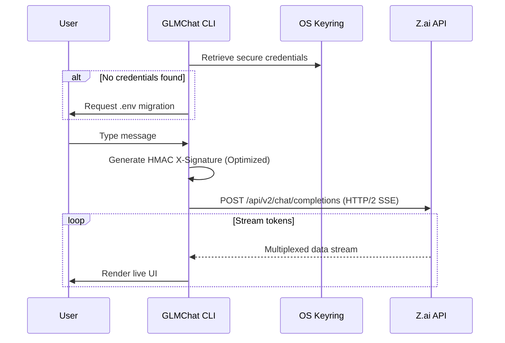

<p align="center">
  
</p>

<p align="center">
  <b>⚡ Lightning-fast CLI client for Z.ai powered by GLM-4.7</b>
</p>

<p align="center">
  <a href="#features"></a>
  <a href="#installation"></a>
  <a href="#usage"></a>
  <a href="https://github.com/TecTroncoso/GLMChat"></a>
</p>

---

## 🧠 What is GLMChat?

**GLMChat** is a high-performance command-line interface for [Z.ai](https://chat.z.ai) — the free AI chatbot platform powered by **GLM-4.7** (Zhipu AI). It brings the full power of GLM's reasoning capabilities directly into your terminal with real-time streaming, thinking visualization, and persistent conversation memory.

No API keys needed. No monthly fees. Just authenticate once and start chatting.

---

## ✨ Features

| Feature | Description |
|---------|-------------|
| 🔥 **Real-time Streaming** | Token-by-token response rendering with event-driven UI |
| 💭 **Thinking Visualization** | Watch the model reason step-by-step in a dedicated panel |
| 🔐 **Enterprise Security** | OS-level credential storage via **Windows Credential Manager / Keyring** |
| ⚡ **HTTP/2 Multiplexing** | High-performance network layer with header compression and multiplexing |
| 🛡️ **Optimized HMAC** | Re-engineered signature generation with pre-sorted keys & pre-encoding |
| 🧵 **Conversation Memory** | Multi-turn context tracking — the AI remembers your chat |
| 🎨 **Beautiful Terminal UI** | Rich-powered panels, markdown rendering & syntax highlighting |

---

## 📦 Installation

### Prerequisites

- **Python 3.9+**
- **Brave Browser** or **Google Chrome** (for initial authentication)

### Setup

```bash
# Clone the repository
git clone https://github.com/TecTroncoso/GLMChat.git
cd GLMChat

# Create virtual environment
python -m venv venv

# Activate (Windows)
venv\Scripts\activate

# Install dependencies
pip install -r requirements.txt
```

### Configuration & Security

GLMChat uses an **Extreme Security** approach. You only need to provide your credentials once; the system will migrate them to your OS-level secure storage (Keyring) and remove them from disk.

1. Create a `data/.env` file:
```bash
mkdir data
```

2. Add your credentials:
```env
# data/.env
ZAI_EMAIL=your_google_email@gmail.com
ZAI_PASSWORD=your_password
```

3. **Run the app**. GLMChat will automatically:
   - Detect the credentials in `.env`.
   - Move them to the **Windows Credential Manager**.
   - Clean the `.env` file to ensure no secrets are stored in plaintext.

> [!IMPORTANT]
> After the first run, you can safely delete the email/password lines from `.env`. Your secrets are now encrypted by your Operating System.

---

## 🚀 Usage

### Interactive Mode

```bash
python main.py
```

### Single Prompt Mode

```bash
python main.py "Explain quantum entanglement like I'm five"
```

---

## 📁 Project Structure

```
GLMChat/
├── main.py              # Entry point — CLI logic
├── src/
│   ├── secrets.py       # [NEW] OS Keyring & credential migration logic
│   ├── auth.py          # Automated Google OAuth via nodriver
│   ├── client.py        # Z.ai API client (HTTP/2 + HMAC)
│   ├── config.py        # Secure configuration & constants
│   └── display.py       # Rich terminal UI renderer
├── data/
│   └── .env             # Non-sensitive config only (Secrets moved to Keyring)
└── assets/              # Banners and media
```

---

## ⚙️ How It Works



---

## 🔧 Technical Highlights

### 🛡️ Security Architecture
- **Keyring Integration**: Credentials are never stored in plaintext after the first run. We use the OS-native secret store (AES-256 encrypted by Windows/macOS/Linux).
- **Auto-Migration**: Seamless DX that moves users from insecure `.env` files to professional secret management automatically.

### ⚡ Performance Optimizations
- **HTTP/2 multiplexing**: Enabled `http2=True` for faster header compression and concurrent stream handling.
- **HMAC Optimization**: Signature generation now uses fixed key ordering, eliminating `sorted()` calls per request.
- **Pre-encoded Salt**: The Z.ai salt key is encoded to bytes once at import time, saving CPU cycles on every message.
- **Event-Driven Rendering**: `rich.Live` updates only when new tokens arrive, minimizing terminal flicker and CPU usage.

---

## 📋 Dependencies

| Package | Purpose |
|---------|---------|
| [`keyring`](https://github.com/jaraco/keyring) | Secure OS-level credential management |
| [`rich`](https://github.com/Textualize/rich) | Premium Terminal UI & Markdown |
| [`httpx[http2]`](https://github.com/encode/httpx) | HTTP/2 Client with SSE support |
| [`nodriver`](https://github.com/ultrafunkamsterdam/nodriver) | Undetected browser automation |


---

## 🤝 Contributing

Contributions are welcome! Feel free to:

1. Fork the repository
2. Create a feature branch (`git checkout -b feature/amazing-feature`)
3. Commit your changes (`git commit -m 'Add amazing feature'`)
4. Push to the branch (`git push origin feature/amazing-feature`)
5. Open a Pull Request

---

## 📄 License

This project is for educational and personal use. Z.ai is a product of [Zhipu AI](https://www.zhipuai.cn/).

---

<p align="center">
  Made with ❤️ by <a href="https://github.com/TecTroncoso">TecTroncoso</a>
</p>
